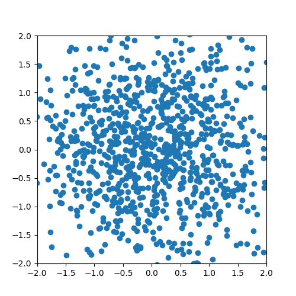

## What is this? 

A port of the paper in JAX (originally written in Theano)

## Commands

```bash

time python diffusion.py train --epochs 10000

time python diffusion.py inference --checkpoint ./models/spiral.epx

```


## Credits

```bibtex

@misc{sohldickstein2015deepunsupervisedlearningusing,
      title={Deep Unsupervised Learning using Nonequilibrium Thermodynamics}, 
      author={Jascha Sohl-Dickstein and Eric A. Weiss and Niru Maheswaranathan and Surya Ganguli},
      year={2015},
      eprint={1503.03585},
      archivePrefix={arXiv},
      primaryClass={cs.LG},
      url={https://arxiv.org/abs/1503.03585}, 
}

```

It should be noted I've been trying to recreate the spiral dataset diffusion using the original paper []()
but the loss function prescribed there wasn't getting the structure restoration right

The ONLY working implementation (in the spirit of the original paper) was here: https://github.com/hrbigelow/simple-diffusion

All credits goes too [Henry Bigelow](https://github.com/hrbigelow) whose github moniker is @hrbigleow

I've included a Jax translation of what he did

Training a MLP to reverse the noising has been ultra ultra hard
