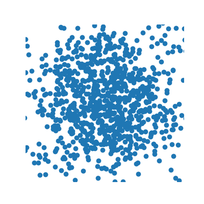

<h1 align='center'> Deep Unsupervised Learning using Nonequilibrium Thermodynamics (using JAX and Equinox)</h1>




## What is this? 

A JAX & Equinox port of the paper [Deep Unsupervised Learning using Nonequilibrium Thermodynamics](https://arxiv.org/abs/1503.03585)'s [code](https://github.com/Sohl-Dickstein/Diffusion-Probabilistic-Models) (originally written in Theano).

**Why Jax you ask?** It has a very Haskell feel to it and among other things, things like `vmap` makes the batch dimension the framework's problem

**Why Equinox you ask?** Uber cool and convenient. Please be sure to check it out here [https://docs.kidger.site/equinox/](https://docs.kidger.site/equinox/) 


## Crucial differences

1. As opposed to the original implementation, the schedule is not learnt. Learning the schedule is a training nightmare. This implementation has a linear schedule patched in.
2. Other differences are mentioned in the file `porting_notes.md` (present in this repo)


## Commands

```bash

# for inferencing

time python scripts/inferencing sohl

time python scripts/inferencing spiral

# for training

time python scripts/training sohl

time python scripts/training spiral

```


## Credits

```bibtex

@misc{sohldickstein2015deepunsupervisedlearningusing,
      title={Deep Unsupervised Learning using Nonequilibrium Thermodynamics}, 
      author={Jascha Sohl-Dickstein and Eric A. Weiss and Niru Maheswaranathan and Surya Ganguli},
      year={2015},
      eprint={1503.03585},
      archivePrefix={arXiv},
      primaryClass={cs.LG},
      url={https://arxiv.org/abs/1503.03585}, 
}

```

It should be noted I've been trying to recreate the **spiral dataset diffusion** using the original paper
but the loss function prescribed there wasn't getting the structure restoration right

The ONLY working implementation for the **spiral dataset diffusion** (somewhat in the spirit of the original paper) was here: https://github.com/hrbigelow/simple-diffusion

The credits for  goes too [Henry Bigelow](https://github.com/hrbigelow) whose github moniker is @hrbigleow

I've included a Jax & Equinox translation of what he did


## LICENSE

MIT license as with the original code
